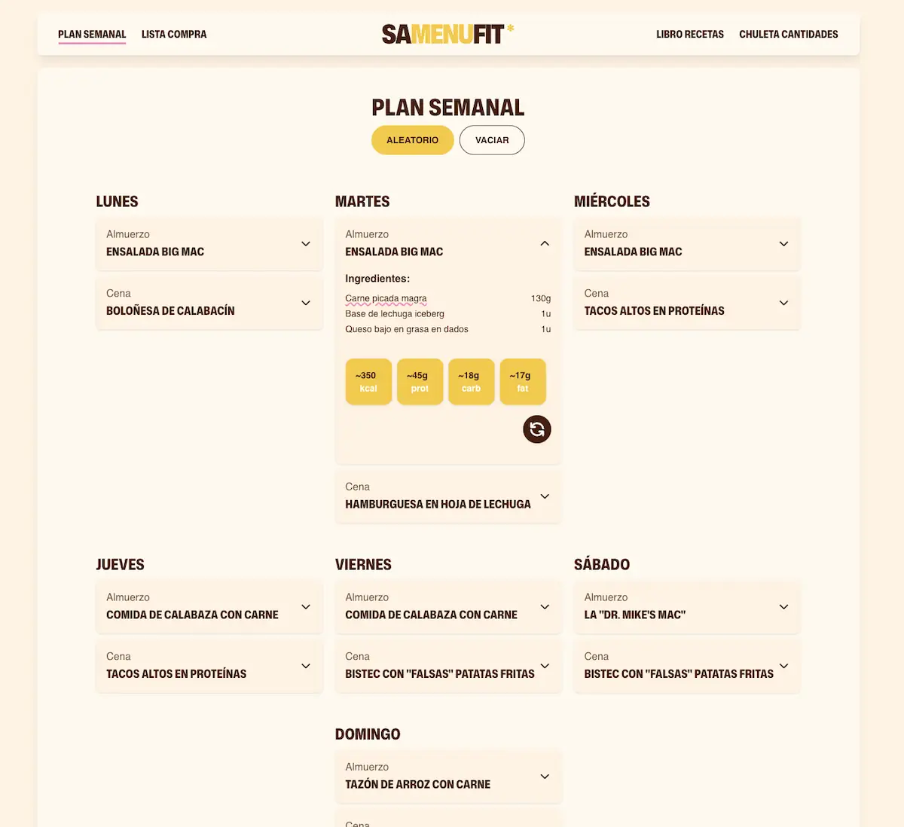

# 🍽️ SaMenufit

_Tu asistente inteligente para planificación de comidas y nutrición_

<div align="center">

[](https://vuejs.org/)
[](https://www.typescriptlang.org/)
[](https://vitejs.dev/)
[](https://tailwindcss.com/)

</img>

</div>

---

## 📖 Descripción

**SaMenufit** es una aplicación web que simplifica la gestión de mi menu diario, siguiendo recetas de [Doctor Mike Diamonds](https://www.youtube.com/@DoctorMikeDiamonds). Me ayuda a hacer la lista de la compra y no pasarme de calorias. Creado como proyecto para poner en practica lo aprendido de Vue.

## ✨ Características Principales

### 📅 **Planificación Semanal**

- Interfaz visual para programar comidas
- Creacion aleatoria
- Seguimiento del equilibrio nutricional

### 🍲 **Gestión de Recetas**

- Crea y almacena tus recetas personalizadas
- Información nutricional detallada
- Importación y exportación de recetas

### 🛒 **Listas de Compra Inteligentes**

- Generación automática desde el plan semanal
- Consolidación de ingredientes

### 📊 **Seguimiento Nutricional**

- Cálculo de macros y micronutrientes
- Visualización de datos nutricionales

## 🛠️ Stack Tecnológico

| Tecnología       | Versión   | Propósito                              |
| ---------------- | --------- | -------------------------------------- |
| **Vue 3**        | `^3.5.18` | Framework frontend con Composition API |
| **TypeScript**   | -         | Tipado estático y mejor DX             |
| **Pinia**        | `^3.0.3`  | Gestión de estado                      |
| **Vue Router**   | `^4.5.1`  | Enrutamiento SPA                       |
| **Tailwind CSS** | `^4.1.12` | Estilos y diseño responsive            |
| **Vite**         | -         | Herramienta de construcción            |
| **Bun**          | -         | Gestor de paquetes ultrarrápido        |

## 🏗️ Arquitectura

SamenuFit implementa **Screaming Architecture** con principios de **Domain-Driven Design**:

```
📁 Contextos Delimitados
├── 🍽️ meal-planning/     # Planificación de comidas
├── 📚 recipes/           # Gestión de recetas
├── 🛒 shopping-lists/    # Listas de compra
└── 🔄 shared/           # Kernel compartido
```

## 🚀 Inicio Rápido

### Requisitos Previos

- **Node.js**: `^20.19.0` o `>=22.12.0`
- **Bun**: Gestor de paquetes

### Instalación

```bash
# 1. Clonar el repositorio
git clone https://github.com/samuhlo-training/samenufit.git
cd samenufit

# 2. Instalar dependencias
bun install

# 3. Iniciar servidor de desarrollo
bun dev
```

¡Listo! La aplicación estará disponible en `http://localhost:5173`

## 📜 Comandos Disponibles

```bash
# Desarrollo
bun dev                 # Servidor de desarrollo
bun preview            # Vista previa de producción

# Construcción
bun run build          # Construcción para producción
bun run type-check     # Verificación de tipos

# Calidad de código
bun lint               # Linter con corrección automática
bun run format         # Formateo de código
```

## 📂 Estructura del Proyecto

```
src/
├── 🏠 app/
│   ├── layout/         # Layouts principales
│   └── pages/          # Páginas de la aplicación
├── 🍽️ meal-planning/
│   ├── recipes/        # Gestión de recetas
│   ├── shopping-lists/ # Listas de compra
│   └── weekly-plans/   # Planificación semanal
├── 🔧 infrastructure/
│   ├── router/         # Configuración de rutas
│   └── storage/        # Adaptadores de almacenamiento
├── 🤝 shared/
│   ├── components/     # Componentes reutilizables
│   ├── types/          # Tipos TypeScript
│   └── utils/          # Utilidades
└── 🎨 assets/          # Recursos estáticos
```

## 🔧 Entorno de Desarrollo

### IDE Recomendado

- **Visual Studio Code**
- **Extensión**: [Volar](https://marketplace.visualstudio.com/items?itemName=Vue.volar) (Vue Language Features)
- ⚠️ **Desactivar**: Extensión Vetur (conflicto con Volar)

### Configuración Adicional

```bash
# Configurar Git hooks (opcional)
bun run prepare

# Verificar configuración
bun run type-check
```

## 🤝 Contribuir

¡Las contribuciones son bienvenidas! Por favor:

1. 🍴 Haz fork del repositorio
2. 🌿 Crea una rama para tu feature (`git checkout -b feature/nueva-funcionalidad`)
3. ✅ Confirma tus cambios (`git commit -am 'Agregar nueva funcionalidad'`)
4. 📤 Sube la rama (`git push origin feature/nueva-funcionalidad`)
5. 🔄 Abre un Pull Request

<div align="center">
  <p>Hecho con ❤️ por <a href="https://github.com/samuhlo"><span>samulo</span></a></p>
  <p>
    <a href="#-samenufit">⬆️ Volver arriba</a>
  </p>
</div>
